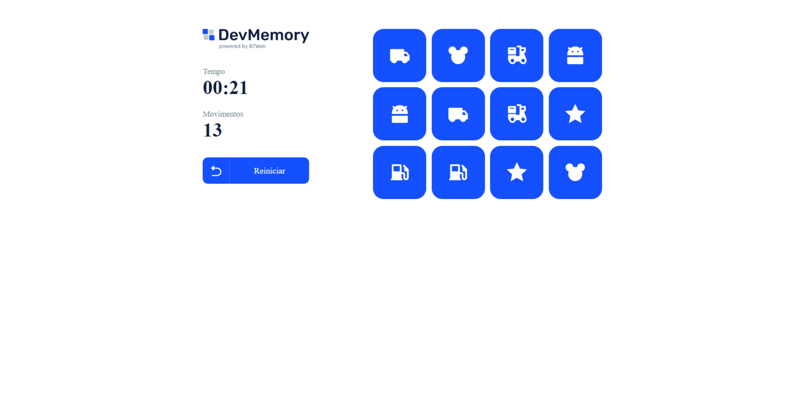

# Memory game

Projeto em React + Typescript fazendo um jogo da memória.

Projeto desenvolvido durante o curso [b7web](https://b7web.com.br)

### Instalação
- `npm install`

### Para Rodar
- `npm start`

### Installation
- `npm install`

### To Run
- `npm start`

### Screenshot

### Links

- Solution URL: [ Jonathan Ribeiro - Github](https://github.com/jowribas)
